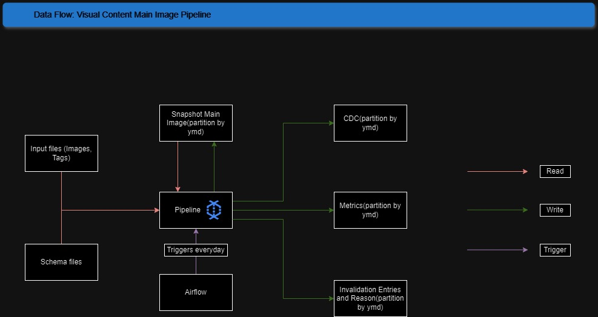

### Architecture

### Data Flow

### Deployment

There will be 3 environments, local, Stage and Production. All code will be deployed in different GCS bucket except the local where you will have your directory. Here The Airflow DAG discovery will identify the DAG from the bucket and can be triggered from the respective Airflow UI. In local you can develop your solution and test in the Stage environment to verify that code works in cloud environment. Post verification, it can be deployed to production. Scaling part is explained in different file (scaling_discussion.md).               
